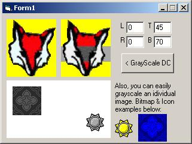



## FYI: DIB Portions

### Description

Nothing special. An example on how to extract a portion of an image or DC into a DIB Section. The project basically is gray scaling, but the guts of the project can be used for most image byte processing. I wanted a way to extract only a small piece (16x16) of a large bitmap, but didn't want to extract the entire bitmap into an array. Also, I needed to be able to update only that small section (16x16) in the appropriate location. This sample project shows how I plan on doing it &amp; thought it might be of use to some of you too. The routines, by using DIB Sections, are extremely fast, regardless of the size of the target. Tweaked just a bit: 3 Oct/15:00 est
 
### More Info
 

             |
---                |---
**Submitted On**   |2005-10-03 22:17:46
**By**             |[LaVolpe](https://github.com/Planet-Source-Code/PSCIndex/blob/master/ByAuthor/lavolpe.md)
**Level**          |Intermediate
**User Rating**    |5.0 (40 globes from 8 users)
**Compatibility**  |VB 6\.0
**Category**       |[Graphics](https://github.com/Planet-Source-Code/PSCIndex/blob/master/ByCategory/graphics__1-46.md)
**World**          |[Visual Basic](https://github.com/Planet-Source-Code/PSCIndex/blob/master/ByWorld/visual-basic.md)
**Archive File**   |[FYI\_\_DIB\_P1937251032005\.zip](https://github.com/Planet-Source-Code/lavolpe-fyi-dib-portions__1-62747/archive/master.zip)

